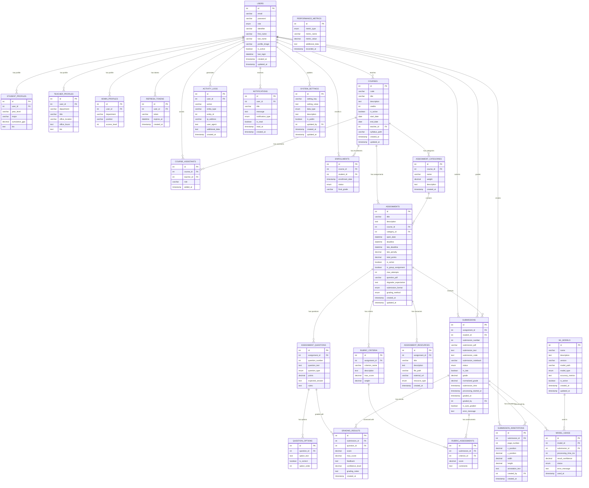

```mermaid
erDiagram
    USERS {
        int id PK
        varchar email
        varchar password
        enum role
        varchar identifier
        varchar first_name
        varchar last_name
        varchar profile_image
        boolean is_active
        datetime last_login
        timestamp created_at
        timestamp updated_at
    }
    
    STUDENT_PROFILES {
        int id PK
        int user_id FK
        varchar year_level
        varchar major
        decimal cumulative_gpa
        text bio
    }
    
    TEACHER_PROFILES {
        int id PK
        int user_id FK
        varchar department
        varchar title
        varchar office_location
        text office_hours
        text bio
    }
    
    ADMIN_PROFILES {
        int id PK
        int user_id FK
        varchar department
        varchar position
        int access_level
    }
    
    REFRESH_TOKENS {
        int id PK
        int user_id FK
        varchar token
        datetime expires_at
        timestamp created_at
    }
    
    COURSES {
        int id PK
        varchar code
        varchar title
        text description
        int credits
        boolean is_active
        date start_date
        date end_date
        int teacher_id FK
        varchar syllabus_path
        timestamp created_at
        timestamp updated_at
    }
    
    COURSE_ASSISTANTS {
        int id PK
        int course_id FK
        int teacher_id FK
        varchar role
        timestamp added_at
    }
    
    ENROLLMENTS {
        int id PK
        int course_id FK
        int student_id FK
        timestamp enrollment_date
        enum status
        varchar final_grade
    }
    
    ASSIGNMENT_CATEGORIES {
        int id PK
        int course_id FK
        varchar name
        decimal weight
        text description
        timestamp created_at
    }
    
    ASSIGNMENTS {
        int id PK
        varchar title
        text description
        int course_id FK
        int category_id FK
        datetime open_date
        datetime deadline
        datetime late_deadline
        decimal late_penalty
        decimal total_points
        boolean is_active
        boolean is_group_assignment
        int max_attempts
        varchar question_pdf
        text nbgrader_expectation
        enum submission_format
        enum grading_method
        timestamp created_at
        timestamp updated_at
    }
    
    ASSIGNMENT_QUESTIONS {
        int id PK
        int assignment_id FK
        int question_number
        text question_text
        enum question_type
        decimal points
        text expected_answer
        text rubric
    }
    
    QUESTION_OPTIONS {
        int id PK
        int question_id FK
        text option_text
        boolean is_correct
        int option_order
    }
    
    RUBRIC_CRITERIA {
        int id PK
        int assignment_id FK
        varchar criterion_name
        text description
        decimal max_score
        decimal weight
    }
    
    ASSIGNMENT_RESOURCES {
        int id PK
        int assignment_id FK
        varchar title
        text description
        varchar file_path
        varchar external_url
        enum resource_type
        timestamp created_at
    }
    
    SUBMISSIONS {
        int id PK
        int assignment_id FK
        int student_id FK
        int submission_number
        varchar submission_pdf
        text submission_text
        text submission_code
        varchar submission_notebook
        enum status
        boolean is_late
        decimal grade
        decimal normalized_grade
        timestamp submission_time
        timestamp processing_started_at
        timestamp graded_at
        int graded_by FK
        boolean is_auto_graded
        text error_message
    }
    
    GRADING_RESULTS {
        int id PK
        int submission_id FK
        int question_id FK
        decimal score
        decimal max_score
        text feedback
        decimal confidence_level
        text grading_notes
        timestamp created_at
    }
    
    RUBRIC_ASSESSMENTS {
        int id PK
        int submission_id FK
        int criterion_id FK
        decimal score
        text comments
    }
    
    SUBMISSION_ANNOTATIONS {
        int id PK
        int submission_id FK
        int page_number
        decimal x_position
        decimal y_position
        decimal width
        decimal height
        text annotation_text
        int created_by FK
        timestamp created_at
    }
    
    ML_MODELS {
        int id PK
        varchar name
        text description
        varchar version
        varchar model_path
        enum model_type
        text accuracy_metrics
        boolean is_active
        timestamp created_at
        timestamp updated_at
    }
    
    MODEL_USAGE {
        int id PK
        int model_id FK
        int submission_id FK
        int processing_time_ms
        decimal result_confidence
        enum status
        text error_message
        timestamp used_at
    }
    
    PERFORMANCE_METRICS {
        int id PK
        enum metric_type
        varchar metric_name
        decimal metric_value
        text additional_data
        timestamp recorded_at
    }
    
    ACTIVITY_LOGS {
        int id PK
        int user_id FK
        varchar action
        varchar entity_type
        int entity_id
        varchar ip_address
        text user_agent
        text additional_data
        timestamp created_at
    }
    
    NOTIFICATIONS {
        int id PK
        int user_id FK
        varchar title
        text message
        enum notification_type
        boolean is_read
        timestamp read_at
        timestamp created_at
    }
    
    SYSTEM_SETTINGS {
        int id PK
        varchar setting_key
        text setting_value
        enum data_type
        text description
        boolean is_public
        int updated_by FK
        timestamp created_at
        timestamp updated_at
    }
    
    USERS ||--o{ STUDENT_PROFILES : "has profile"
    USERS ||--o{ TEACHER_PROFILES : "has profile"
    USERS ||--o{ ADMIN_PROFILES : "has profile"
    USERS ||--o{ REFRESH_TOKENS : "has tokens"
    USERS ||--o{ COURSES : "teaches"
    USERS ||--o{ COURSE_ASSISTANTS : "assists"
    USERS ||--o{ ENROLLMENTS : "enrolls in"
    USERS ||--o{ SUBMISSIONS : "submits"
    USERS ||--o{ SUBMISSIONS : "grades"
    USERS ||--o{ SUBMISSION_ANNOTATIONS : "creates"
    USERS ||--o{ ACTIVITY_LOGS : "generates"
    USERS ||--o{ NOTIFICATIONS : "receives"
    USERS ||--o{ SYSTEM_SETTINGS : "updates"
    
    COURSES ||--o{ COURSE_ASSISTANTS : "has assistants"
    COURSES ||--o{ ENROLLMENTS : "has enrollments"
    COURSES ||--o{ ASSIGNMENT_CATEGORIES : "has categories"
    COURSES ||--o{ ASSIGNMENTS : "has assignments"
    
    ASSIGNMENT_CATEGORIES ||--o{ ASSIGNMENTS : "contains"
    
    ASSIGNMENTS ||--o{ ASSIGNMENT_QUESTIONS : "has questions"
    ASSIGNMENTS ||--o{ RUBRIC_CRITERIA : "has criteria"
    ASSIGNMENTS ||--o{ ASSIGNMENT_RESOURCES : "has resources"
    ASSIGNMENTS ||--o{ SUBMISSIONS : "receives"
    
    ASSIGNMENT_QUESTIONS ||--o{ QUESTION_OPTIONS : "has options"
    ASSIGNMENT_QUESTIONS ||--o{ GRADING_RESULTS : "graded with"
    
    RUBRIC_CRITERIA ||--o{ RUBRIC_ASSESSMENTS : "assessed with"
    
    SUBMISSIONS ||--o{ GRADING_RESULTS : "has results"
    SUBMISSIONS ||--o{ RUBRIC_ASSESSMENTS : "has assessments"
    SUBMISSIONS ||--o{ SUBMISSION_ANNOTATIONS : "has annotations"
    SUBMISSIONS ||--o{ MODEL_USAGE : "processed by"
    
    ML_MODELS ||--o{ MODEL_USAGE : "used in"
```
